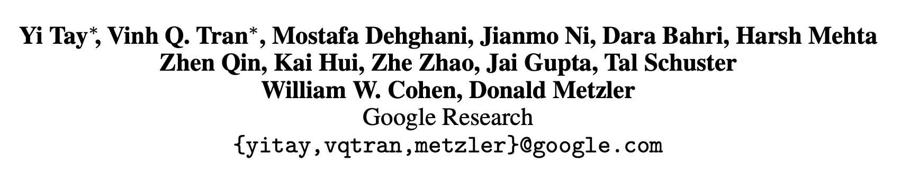
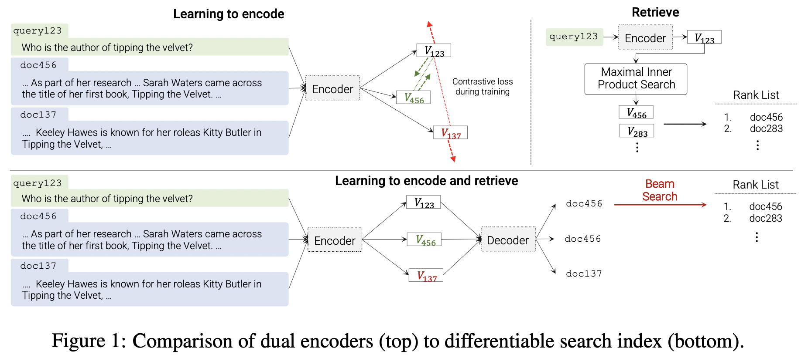

# Transformer Memory as a Differentiable Search Index

论文链接 [Transformer Memory as a Differentiable Search Index](https://proceedings.neurips.cc/paper_files/paper/2022/file/892840a6123b5ec99ebaab8be1530fba-Paper-Conference.pdf)

## 一言以蔽之
生成式检索最早的探索工作。
提出 Differentiable Search Index (DSI)，以数字ID作为文档标识符，并用端到端的方式从query直接生成相关的docid。

## 方法
