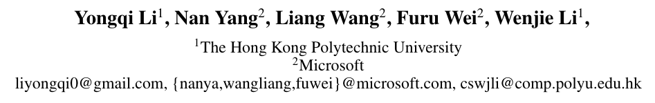
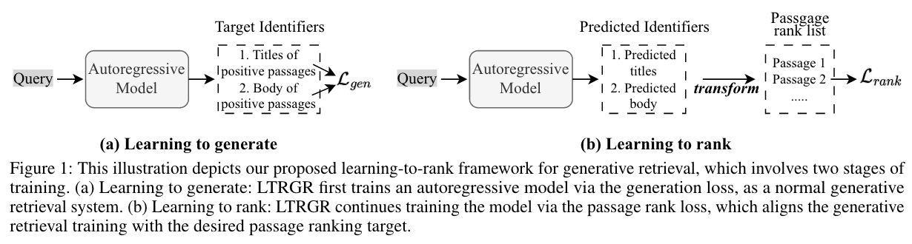
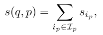
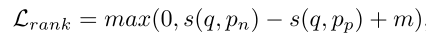
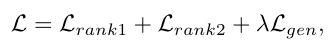
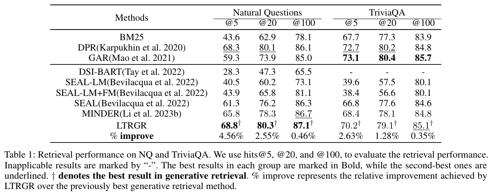
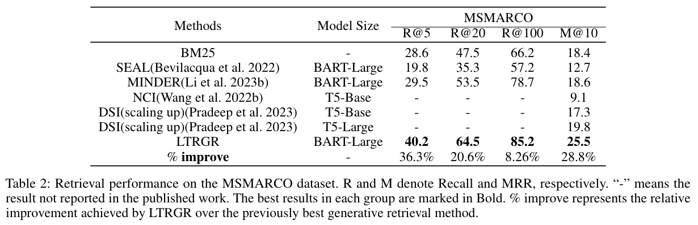
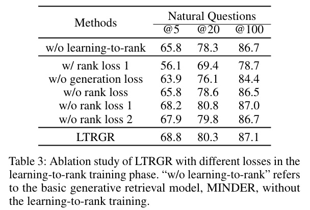
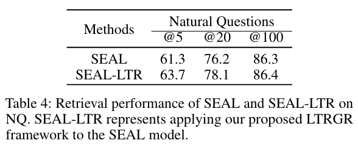

# Learning to Rank in Generative Retrieval

论文链接 [Learning to Rank in Generative Retrieval](https://arxiv.org/pdf/2306.15222.pdf)

代码地址 https://github.com/liyongqi67/LTRGR

## 一句话概括
在sft基础上再训一步，增加 pair loss。

> 要说为什么这也能发，可能是结果sota吧。

## 动机
- 如果docid是doc中的文本片段，那么同一个docid可能对应很多doc。生成式检索依靠启发式函数将预测的docid转换为doc排名列表，需要敏感的超参，且在学习框架之外。而且，生成式检索生成docid作为中间目标，而不是直接对doc进行排名。生成doc的学习目标 & doc排序目标 存在gap。因此，即便自回归模型能生成准确的docid，也未必确保最佳的doc排名。

本文提出一种用于生成式检索的学习排序框架，LTRGR。LTRGR 使生成检索能够直接学习对段落进行排名，通过排名损失优化自回归模型以实现最终的段落排名目标。 该框架仅需要额外的学习排序训练阶段来增强当前的生成检索系统，并且不会给推理阶段增加任何负担。 我们在三个公共基准上进行了实验，结果表明 LTRGR 在生成检索方法中实现了 SOTA 性能。

## 方法

### Learning to Generate
follow当前sota的生成式检索方法，MINDER。使用自回归语言模型生成 multiview identifiers。

三种 view：title，substring，pseudo-query

训练自回归模型生成docid；infer时通过 FM-index 限制模型生成合法 docid。

模型通过beam search生成了一堆 docic。
我们给这些docid对应的每个doc打分，分数就是其对应的被检索出来的 docid 们的分数之和。（docid和doc是多对多的关系）

### Learning to Rank
现在的流程是，先检索docid，再对doc排序，两步走不方便。于是使用 rank loss 继续训练模型。

二阶段训练：多任务：排序+生成。（rank1是 分数最高的pair，rank2是随机pair）

## 实验
### 实验设置
**数据集**：NQ，TriviaQA，MSMARCO

**模型**：BART-large。基于训好的MINDER，继续做 learning to rank 训练。

**超参**：Adam优化器，lr=1e-5，bsz=4，epoch=3。对每个query，检索最多top200 doc。训练时每个query最多40 docid。使用单张A100完成所有实验。

### 实验结果
- 语义docid（SEAL，MINDER）优于数字docid（DSI）
- 本文方法优于MINDER，说明learning to rank有帮助

**消融实验**

**Learning to Rank 基于其它方法，也有效**

## 相关工作
- Generative Retrieval
- Learning to Rank
- Dense Retrieval