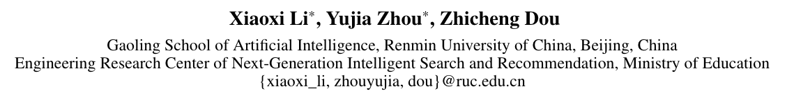
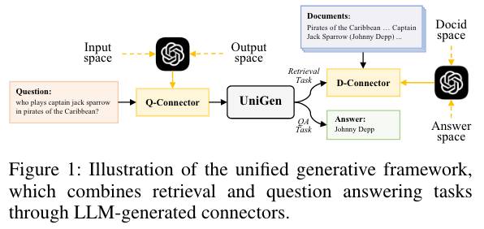
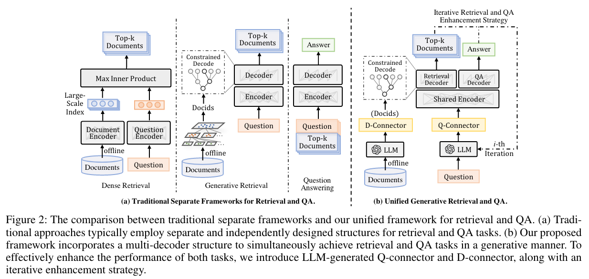

# UniGen: A Unified Generative Framework for Retrieval and Question Answering with Large Language Models

论文链接 [UniGen: A Unified Generative Framework for Retrieval and Question Answering with Large Language Models](https://arxiv.org/pdf/2312.11036.pdf)

## 摘要
生成信息检索包括生成文档检索（GDR）和接地答案生成（GAR）两大任务，在信息检索和自然语言处理领域获得了极大的关注。 GDR 和 GAR 的现有方法依赖于单独的检索和阅读器模块，这阻碍了同时优化。 为了克服这个问题，我们提出了 UniGen，这是一个用于检索和问答的统一生成框架，利用大型语言模型的功能将这两项任务集成到一个生成模型中。 UniGen 采用共享编码器和两个不同的解码器来进行生成检索和问题回答。 为了促进这两项任务的学习，我们引入了由大型语言模型生成的连接器，以弥合查询输入和生成目标之间以及文档标识符和答案之间的差距。 此外，我们提出了一种迭代增强策略，利用生成的答案和检索的文档来迭代改进这两项任务。 通过对 MS MARCO 和 NQ 数据集的大量实验，我们证明了 UniGen 的有效性，展示了其在检索和问答任务中的卓越性能。

## 方法

## 相关工作
**生成式检索** 生成检索是一种创新的信息检索方法，它利用预先训练的语言模型的参数作为可微索引（Tay et al. 2022），从而能够直接生成相关文档标识符。 该领域的最新研究主要集中在文档表示和模型训练上。 对于文档表示，现有研究从 DSI (Tay et al. 2022) 中汲取灵感，并探索了各种方法，例如原子标识符、文本片段和语义集群。 其中，文本片段因其易用性和可解释性而脱颖而出。 例如，Ultron（Zhou et al. 2022b）利用文档 URL 和标题作为表示，而 SEAL（Bevilacqua et al. 2022）将文件中的所有 n-gram 视为潜在标识符。 MINDER（Li et al. 2023）采用多视图方法，结合了合成标识符、标题和子字符串。 对于模型训练，一种简单而有效的方法是使用生成的伪查询数据来训练模型，以学习伪查询与其相应的 docid 之间的映射（Zhuang et al. 2022；Wang et al. 2022；Zhou、Dou 和 Wen 2023；Wang 等人，2023；Zhou 等人，2022a）。 随后，使用标记的查询文档数据来进一步细化模型。 另一个值得注意的贡献是 TOME（Ren 等人，2023），它提出了一种两阶段模型结构，首先生成与查询相关的段落，然后生成与该段落关联的 URL。