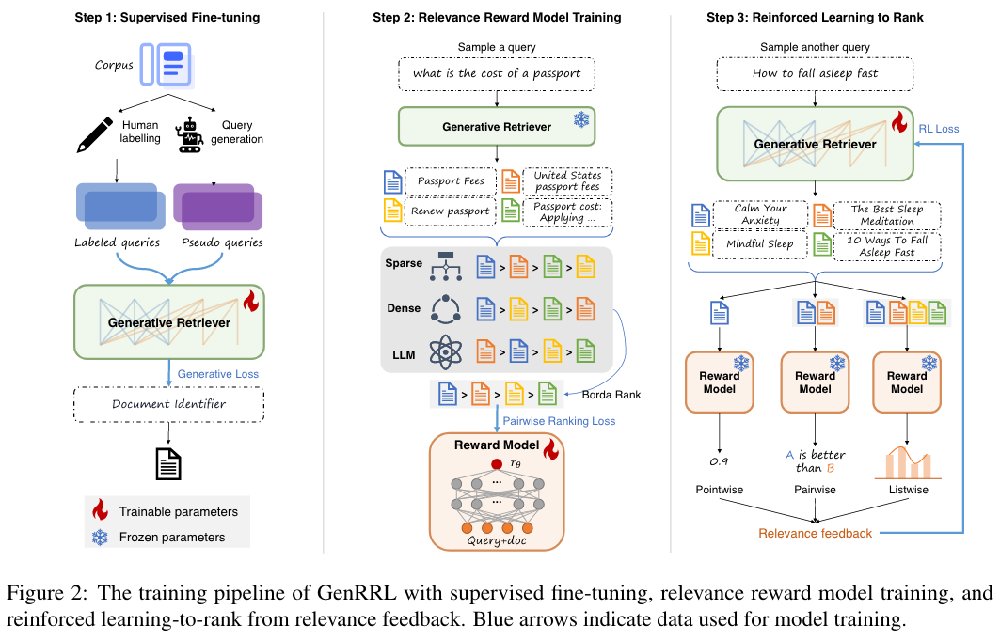
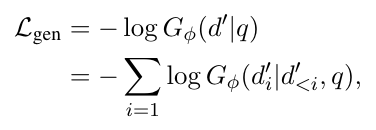
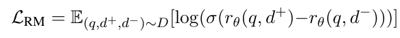
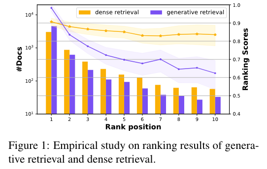

# Enhancing Generative Retrieval with Reinforcement Learning from Relevance Feedback

论文链接 [Enhancing Generative Retrieval with Reinforcement Learning from Relevance Feedback](https://aclanthology.org/2023.emnlp-main.768.pdf)

## 动机
生成式检索面临的挑战：
- 模型主要依靠自回归损失来最大化真实 docid 的 token-level 生成概率。然而，这样的优化目标与排序任务的主要目标（即估计 document-level 相关性）并不相符。
- 过分强调top1结果，而牺牲了整体排名质量

本文提出 Generative Retrieval model with Reinforcement Learning from relevance feedback (GenRRL)，将【docid 生成任务】和【文档相关性评估任务】做对齐。

## 本文贡献
1. 用强化学习改进生成式检索，让docid生成任务 对齐 doc相关性评估任务。
2. 概述了专门为排序任务量身定制的强化训练过程

## 方法

### 训练步骤
1. SFT。训练模型生成 docid。
2. Relevance reward model training. 专门用于衡量 query 和 docid 的相关性，相关性越高，reward分数越高。
3. Reinforced learning-to-rank (L2R) from relevance feedback.

### SFT
- 本文选择 keyword-based docids （比如 url，summary），能够反映doc的语义信息。
- 使用 standard T5 生成 pseudo query，补充训练数据。

### Relevance Reward Model Training
**相关性衡量**
1. Term-based Overlap. 基于术语的重叠涉及查询和文档中相同或相似单词的存在。 TF-IDF 等技术可以有效地衡量这种重叠。 本文使用BM25。
2. Semantic Similarity. 语义相似性不仅仅局限于术语重叠，还深入研究查询和文档中共享的含义或概念。 双编码器模型在通过将查询和文档编码为密集向量来建模语义相似性方面特别有用。 本文使用DPR，给query、doc分别编码成向量，用向量点积衡量相似性。
3. Contextual Dependency. 这种场景是指文档满足查询所表达的信息需求的程度，超越了特定术语或概念所带来的限制。 例如，如果用户一直在搜索“如何节省笔记本电脑电池”。 相关文件可能会说：“降低屏幕亮度并关闭键盘背光”。捕获上下文依赖的技术可以包括语言模型，该模型已证明能够熟练地理解两个句子之间的上下文关系。 本文使用LLaMA-13b 生成doc的概率。

对于每个query，都让微调好的模型生成一些候选doc。用以上三种相关性衡量方式，来给每个doc排序。

本文使用 Borda Rank ，将三种排序转换成一种（综合排序）。

reward model 架构在 SFT好的模型基础上，添加一个随机初始化的线性层，输出一个分数。
使用 pairwise 损失进行训练。

## 实验
### Empirical study
在两个现有模型上对比了 dense retrieval 和 generative retrieval，发现 generative retrieval 在 top1 结果上表现更好，但是 dense retrieval 在排序上有更均衡的效果。

## 细节
使用 constrained beam search，保证生成有效的 docid。
