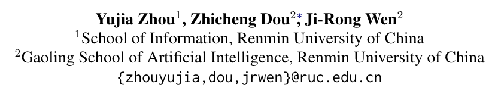

# Enhancing Generative Retrieval with Reinforcement Learning from Relevance Feedback

论文链接 [Enhancing Generative Retrieval with Reinforcement Learning from Relevance Feedback](https://aclanthology.org/2023.emnlp-main.768.pdf)

## 动机
生成式检索面临的挑战：
- token-level 概率优化和更广泛的 document-level 相关性估计之间的差异
- 过分强调top1结果，而牺牲了整体排名质量

为了应对这些挑战，我们提出了一种通过相关性反馈进行强化学习的生成检索模型，旨在将【token-level docid 生成】与【document-level 相关性估计】保持一致。 训练过程包括三个阶段：监督微调、相关性奖励模型训练以及根据相关性反馈强化学习排名。 为了训练高质量的奖励模型，我们在三个渐进的场景下定义了“相关性”，它们共同提供了对文档相关性的全面评估。 在两个基准数据集上进行的实验证明了我们提出的方法的有效性。