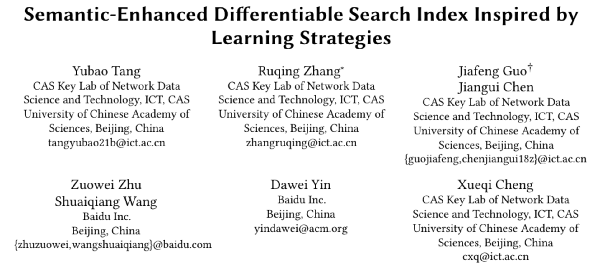
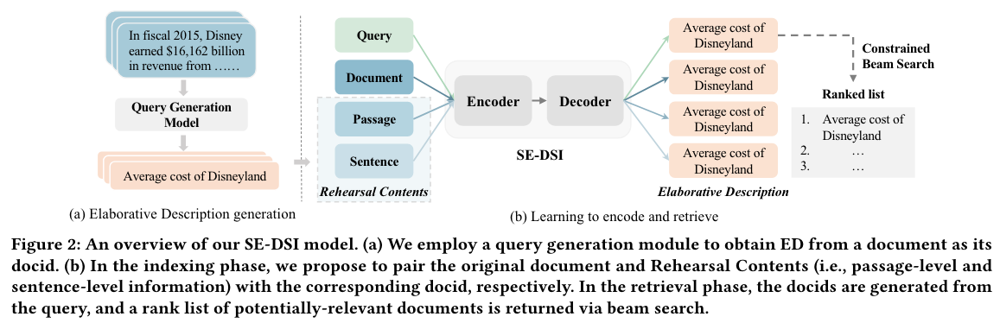
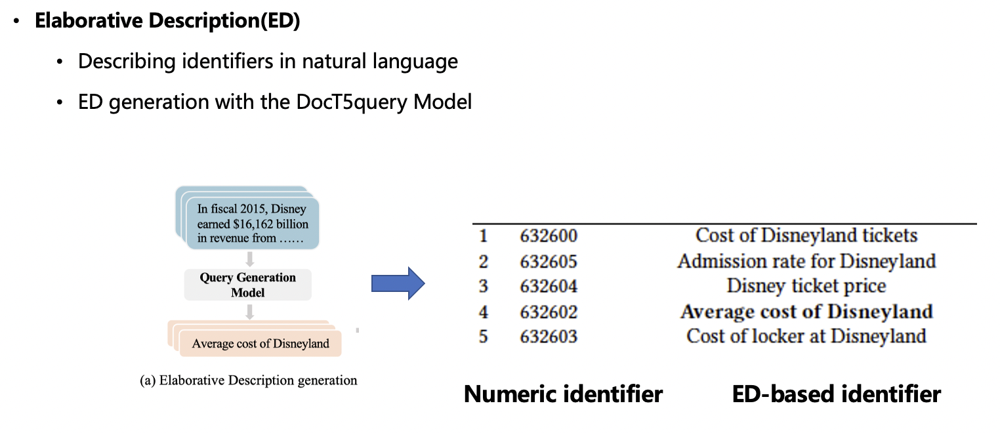
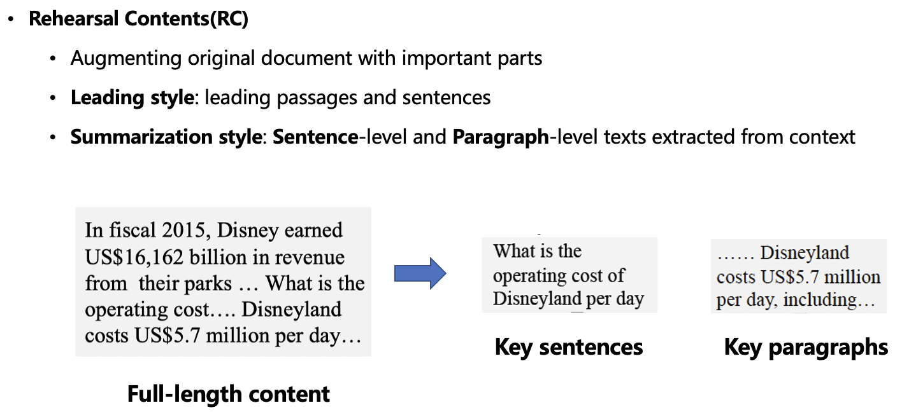
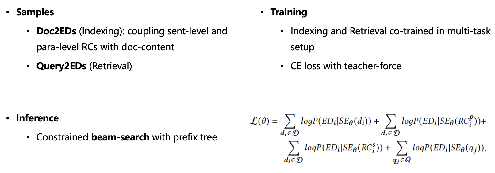
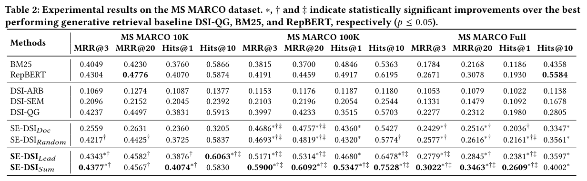
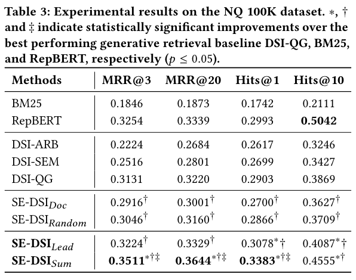

#  Semantic-Enhanced Differentiable Search Index Inspired by Learning Strategies

论文链接 [Semantic-Enhanced Differentiable Search Index Inspired by Learning Strategies](https://arxiv.org/pdf/2305.15115.pdf)

## 动机
Differentiable Search Index (DSI) 需要解决两个问题：
1. 如何给每个 document 一个 identifier
2. 如何学习 document 和 identifier 的对应关系

本文提出 Semantic-Enhanced DSI model (SE-DSI)

## 方法

用自然语言作为docid（而不是数字）

提炼doc的重点内容，用重点内容来检索。（因为如果文章太长，输入模型会截断重要信息）

### 训练

## 实验
数据集: 
MS MARCO dataset, NQ 100K dataset

### 实验结果

