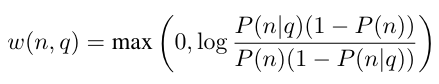

# Autoregressive Search Engines: Generating Substrings as Document Identifiers

论文链接 [Autoregressive Search Engines: Generating Substrings as Document Identifiers](https://proceedings.neurips.cc/paper_files/paper/2022/file/cd88d62a2063fdaf7ce6f9068fb15dcd-Paper-Conference.pdf)

代码地址 https://github.com/facebookresearch/SEAL

## 动机
- 自回归模型未在检索系统中发挥潜力
- 使用自回归语言模型为文档生成 identifier 作为检索的中间目标，会在搜索空间中引入结构，从而比完整的非结构化段落更容易记忆、学习和检索。但如果没有标题之类的元数据，则需要创建标识符，从而创建结构。

## 方法
本文提出一种解决方案 Search Engines with Autoregressive LMs (SEAL)，具有自回归 LM 的搜索引擎 (SEAL)。结合了自回归模型（BART）与压缩全文子字符串索引（FM-Index），不需要搜索空间中的结构信息，而是使用文档中出现的所有 ngram 作为 docid。

- FM-Index 可以限制 BART 的生成，从而防止生成无效标识符（即 ngram 不会出现在任何文档中）
- FM-Index 提供语料库中包含特定 ngram（针对每个解码步骤）的所有文档的信息，从而允许检索它们。

> 此设置允许 SEAL 从语料库中的任何位置生成任何范围，而无需显式编码文档中的所有子字符串。 此外，我们设计了一种新颖的评分函数，将 LM 概率与 FM 索引频率（即整个语料库中 ngram 的出现次数）相结合的多个 ngram 的结果相交。 
> 
> 我们的实验结果表明，SEAL 在自然问题上匹配或优于最新的检索解决方案（包括自回归解决方案），同时需要更少的内存（占用空间小约 2 到 7 倍）。 此外，SEAL 的交叉公式在 KILT 基准上将段落级检索的 SOTA 提高了 10 多个点，有助于建立新的 SOTA 下游结果 与现有的读取器技术配合使用时，可以在多个数据集上进行读取。

### FM-index
本文需求：
1. 受限解码，保证生成的内容都在检索文档中出现过；
2. 能知道 生成的 ngrams 在哪个文档中出现。

FM-index（作为自索引的压缩后缀数组，不需要额外存储原始文本）可以满足需求。

FM-index具体实现没看懂。

### LM 分数：条件概率
每次 decode 都可以得到 k 个 ngram（以及相应的生成概率，称之为 LM 分数）。

### FM 分数：无条件概率

公式中 $F(n, \mathcal{R})$ 代表全文本中 ngram 出现的频率，$d$ 代表文档数。

FM分数 借鉴了 TF-IDF 和 BM25，是无条件 ngram 概率。

**最终分数：生成概率越高，频率越低，分数越高。**

最终分数是 LM 和 FM 分数的结合。可以近似于 LM / FM。

### 对多个 ngram 的交叉评分
由于不同 doc 可能包含相同 ngram，这导致 这些doc没有区分度。
所以，本文用 k 个 ngram 来代表这个doc，给这个doc评分。

公式没看懂。

## 实验（本文做了大量实验）
### 实验设置
**数据集**：
- Natural Questions，约 21M 个片段，每个片段 100 tokens
- KILT，约 36M 个片段，每个片段 100 tokens

**评估**：
- hits@k，即top-k检索结果中属于ground truth的比例。
- R-precision

**模型**：BART large

### 实验结果
下表为压缩空间对比。

#### 主实验

#### 消融实验

#### case
