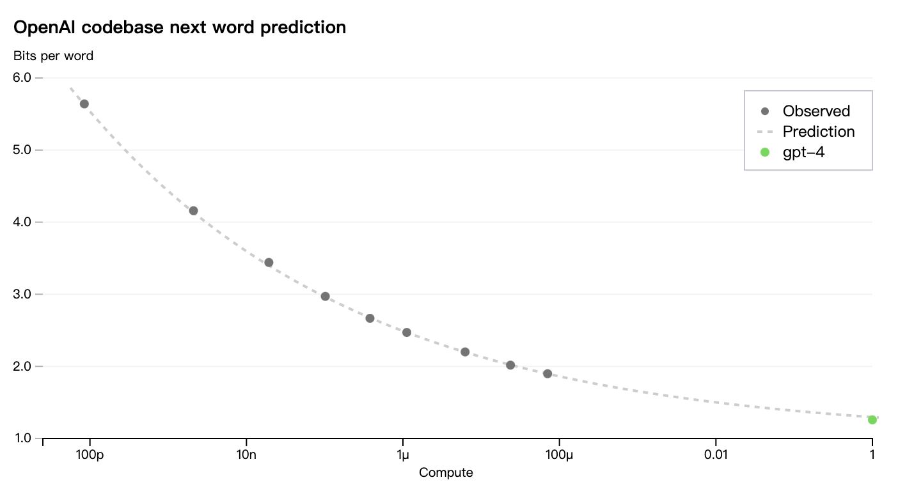

# GPT4

多模态，接受图像和文本输入；输出文本。

GPT4的context length：8192个token。还有一个32k个token的版本。

> 知识是在预训练阶段学会的，RLHF主要是让模型更align人类，生成人类偏好的回答。

## loss预测
loss预测能够在同等资源下，用更快的速度试更多方法。

通过同样训练方式的小模型，预测大模型loss：

## reference
- [GPT4官方技术报告](https://openai.com/research/gpt-4)
- [GPT-4论文精读【论文精读·53】](https://www.bilibili.com/video/BV1vM4y1U7b5/?spm_id_from=333.788&vd_source=cde29199d71ef3753989894755f4f724)