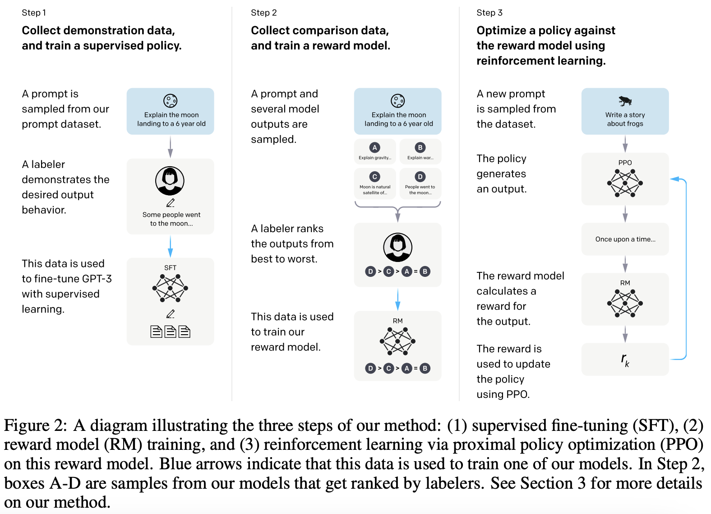

# InstructGPT

## 动机
语言模型的训练目标（预测下一个词）和【follow the user's instructions helpfully and safely】这个目标是有差异的。

## 训练方法
reinforcement learning from human feedback (RLHF)

1. SFT，在instruct数据（问答形式的数据）上对GPT3进行有监督微调
2. 训练奖励模型RM。SFT模型对一个问题生成几个回答，由人类标注答案质量排序；训练奖励模型给答案打分，打分高低要满足人类的排序。
3. 继续训练SFT模型，使得它生成的答案尽可能获得更高的分数（RM评价）。就是每次生成答案后，都给RM模型打分，去优化这个打分。

为什么要有奖励模型：因为step1的训练数据不够。生成式标注的难度要远高于判别式标注的难度。

## 数据集
先人工写了一些prompt数据；训了个内测版模型，放出来让大家玩；然后收集用户玩的过程中提的问题，继续补充训练数据。

样本数量：
| SFT dataset | 13000 |
| RM dataset | 33000 |
| PPO dataset | 31000 |
<!-- 
样本数量：
- SFT dataset：13000
- RM dataset：33000
- PPO dataset：31000 -->

## 效果
1.3B参数的InstructGPT要好于175B参数的GPT3

## reference
- 论文：[Training language models to follow instructions with human feedback](https://arxiv.org/pdf/2203.02155.pdf)