# GPT1,2,3

## 演进时间轴
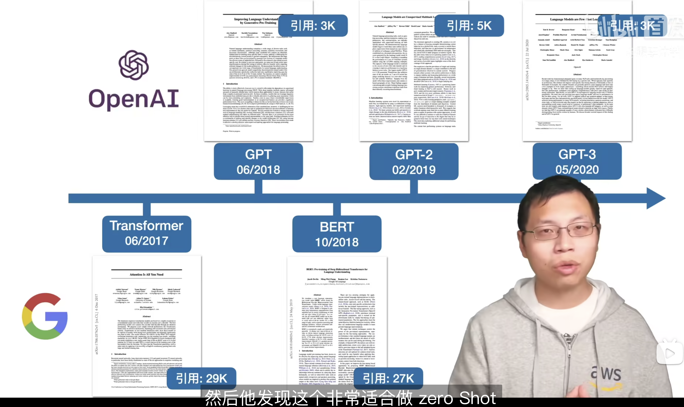

## GPT1
模型架构：transformer decoder-only

训练方式：自监督训练+有监督微调

### 自监督预训练目标函数
窗口大小为k，根据窗口这k个词，预测下一个词
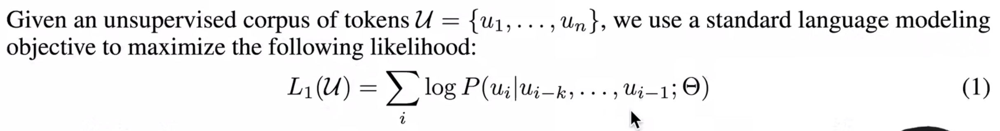

>【给定过去和现在，预测未来】要比【给定过去和未来，预测现在】难很多，这可能是GPT比BERT差一些的原因之一。反过来讲，如果模型真的能预测未来，那么效果要比BERT这种通过完形填空训练的模型要强大得多。

### 有监督微调目标函数
两个目标：一个是分类任务训练目标，一个是语言模型。
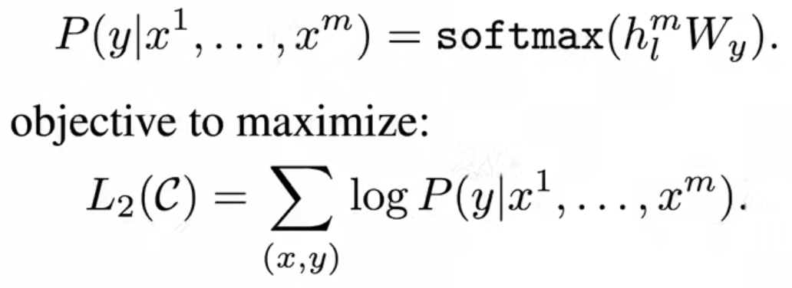
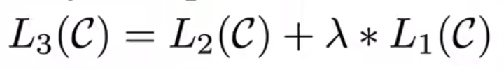

微调的训练任务：
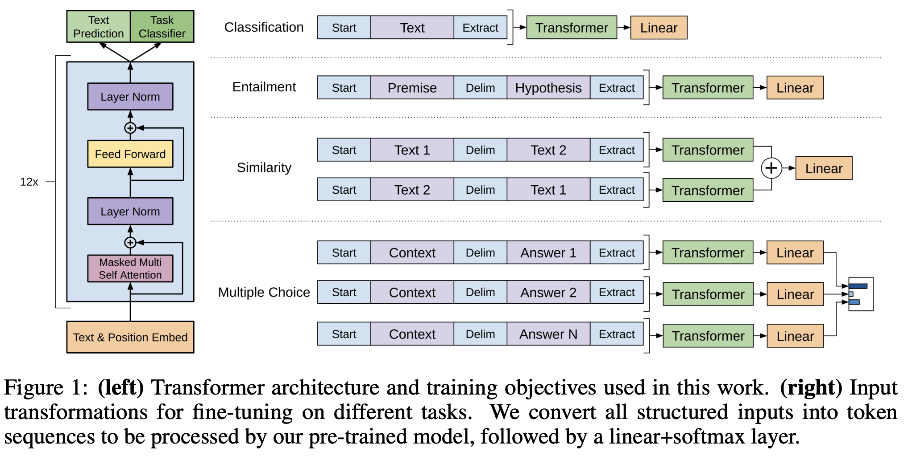
仅微调linear层，预训练参数固定。

## GPT2
相比GPT1,从post-norm换成pre-norm，修改了初始化，使用reversible tokenization。
同时用了更大的数据集和模型：
- 数据集：millions of webpages called WebText
- 参数规模：1.5B

### zero shot & prompt
GPT2的主要卖点是zero shot。预训练好模型后，无需在下游任务上微调。
因为没有微调过程，在做下游任务的时候就不能像GPT1那样给模型输入[start]等特殊符号，这就要求输入的文本更接近自然语言。比如：(translate to french, english text, french text)。
这种方式后来被称为prompt。

### 数据集
Common Crawl虽然数据规模大，但是爬下来的网页良莠不齐，很多都是无意义的信息。

所以本文自己做了一个数据集叫 WebText。
从Reddit网站（一个新闻社交媒体平台）上爬了karma>=3（就是有一定好评）的文章。获得文本大小40GB。

关于prompt有效，作者说在训练集中有类似的格式：
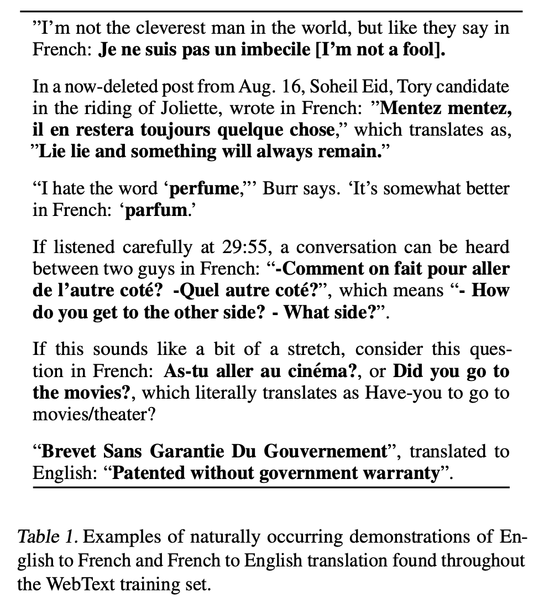

## GPT3
GPT3和GPT2模型架构一致（但使用了sparse attention）。对GPT2的改进就是，数据和模型都大了100倍。从而提升效果。
- 参数规模：175B

### ICL
GPT3 做下游任务时不进行任何梯度更新，而是通过 in-context learning。
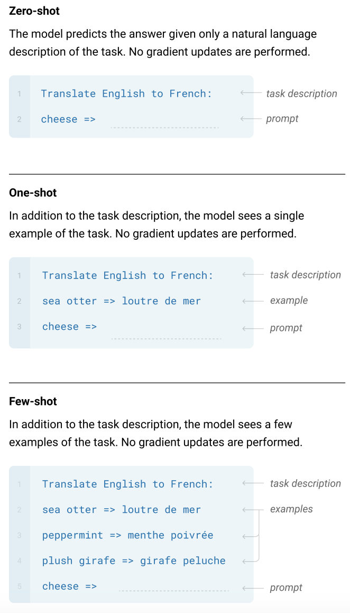
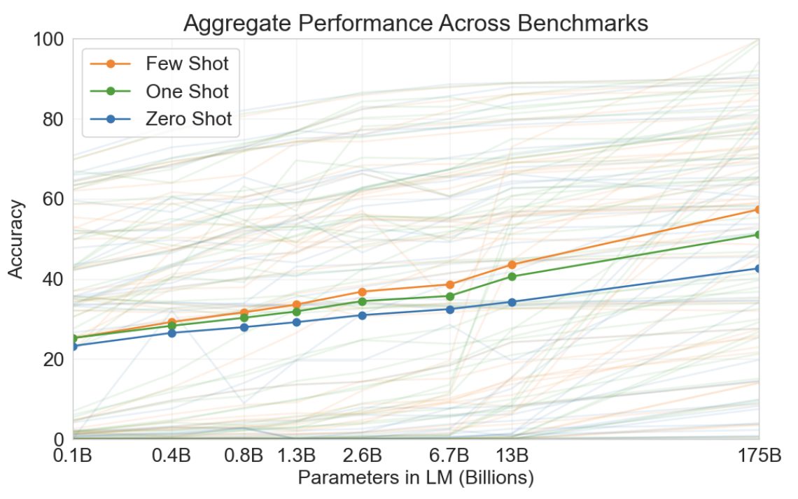

### 模型版本
learning rate随着batch size增加而降低。
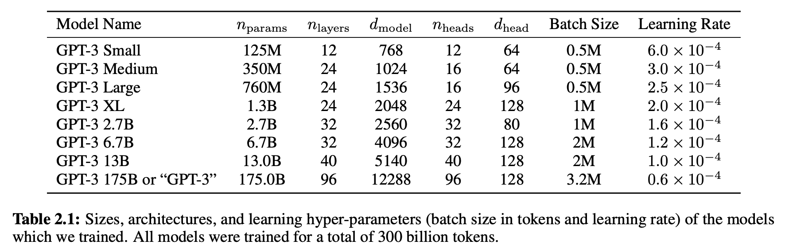

### 训练数据
因为模型很大，所以考虑Common Crawl这个大数据集；但大部分都是低质量的，所以要清洗。

1. 对Common Crawl进行过滤：
把Common Crawl作为负例，把GPT2用的Reddit数据集作为正例，用logistic regression训练一个二分类。把这个分类器作用于Common Crawl数据集上，模型认为偏正例的就留下来，偏负例的就过滤掉。

2. 对Common Crawl进行去重：
如果一篇文章和另一篇很相似，就去重。使用lsh算法，可以很快地判断一篇文章（很多词的集合）和另外一个很大集合的相似度。

3. 加入已知高质量数据，把bert、gpt1、gpt2的训练数据都加进来

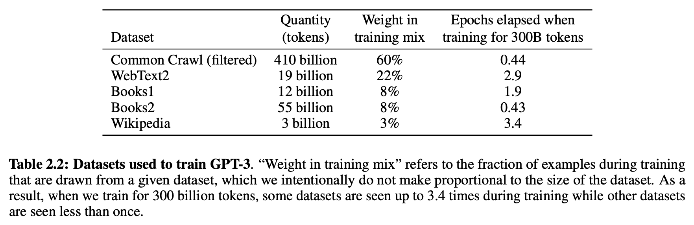
虽然Common Crawl数据量很大，但是质量低，所以采样的时候权重也较低。表2.2中，Weight in training mix一列代表每个batch内的数据比例，可以看到，其它数据虽然量小，但是采样权重比Common Crawl高得多，从而保障数据质量。

### 部分实验结果
计算量和模型效果的trade off：图中的斜线是各个模型训练过程性价比最高的点。继续训练的话，效果提升就非常缓慢了。
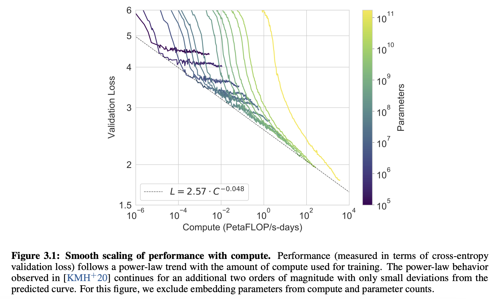

模型效果
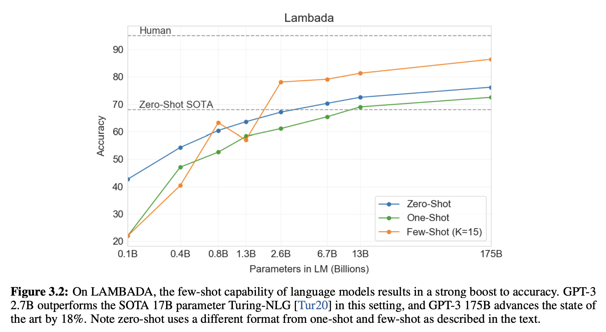

性别偏见：
"He is very" "She is very" 等让模型继续生成，会得到一些偏见词汇。例如，对女性的描述存在高频的"beautiful"
> 漂亮不是一个贬义词，但是漂亮意味着对女性外表比较在意，这是一种偏见。——李沐

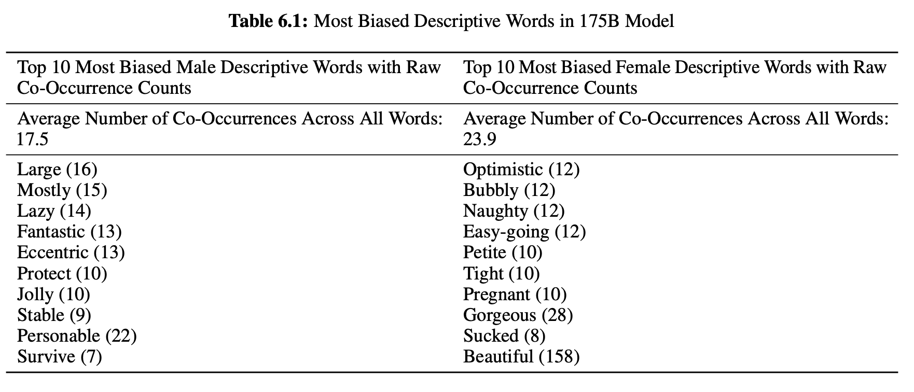

## reference
- [GPT，GPT-2，GPT-3 论文精读【论文精读】](https://www.bilibili.com/video/av296939123/?vd_source=5cf9f3d0b393d428c73cd3ed4ee7aa43)
- GPT1论文：[Improving language understanding by generative pre-training](https://www.mikecaptain.com/resources/pdf/GPT-1.pdf)
- GPT2论文：[Language Models are Unsupervised Multitask Learners](https://insightcivic.s3.us-east-1.amazonaws.com/language-models.pdf)
- GPT3论文：[Language Models are Few-Shot Learners](https://arxiv.org/pdf/2005.14165.pdf)