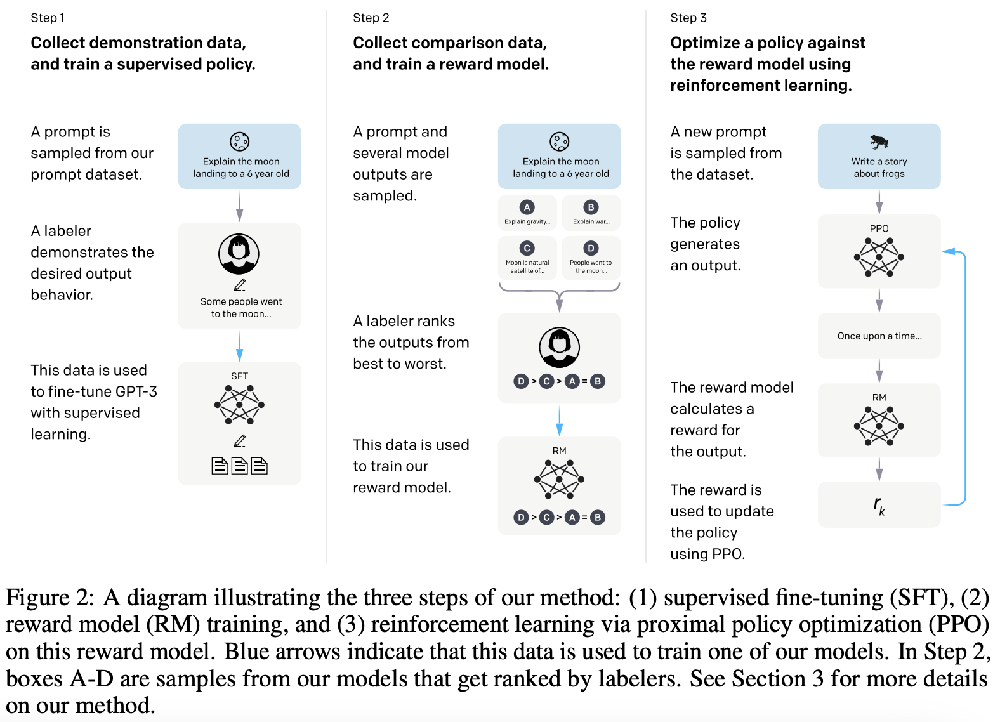

# InstructGPT

## 动机
语言模型的训练目标（预测下一个词）和【follow the user's instructions helpfully and safely】这个目标是有差异的。

## 训练方法
reinforcement learning from human feedback (RLHF)

1. SFT，在instruct数据（问答形式的数据）上对GPT3进行有监督微调
2. 训练奖励模型RM。SFT模型对一个问题生成几个回答，由人类标注答案质量排序；训练奖励模型给答案打分，打分高低要满足人类的排序。
3. 继续训练SFT模型，使得它生成的答案尽可能获得更高的分数（RM评价）。就是每次生成答案后，都给RM模型打分，去优化这个打分。

为什么要有奖励模型：因为step1的训练数据不够。生成式标注的难度要远高于判别式标注的难度。

### 训练SFT
SFT阶段训了16个epoch

### 训练奖励模型
RM模型大小为6B，因为模型太大训练不稳定，loss会飞。

要把排序转换成值，使用 pairwise ranking loss：

其中，k是对同一个问题生成的答案数量（k=9）。对每个答案pair，都希望RM给更好的答案更高的分数，用了LR loss。

简言之，reward model输入的是instruct和response，输出的是一个打分，代表response的好坏。reward model用pair wise的对比损失来训练。

### 强化学习
使用PPO算法。目标函数如下：

第一行是PPO目标函数：$E_(x, y)$是当前的模型对给定输入x生成的输出y，第一项$r_\theta(x, y)$是奖励模型打分，第二项$\beta\log(...)$是KL散度，因为模型更新太大的话，奖励函数打分就可能不准了，所以希望模型参数经过强化学习不要发生太大变化。

第二行是原始GPT3的目标函数：第三项$\gamma...$是在GPT3训练集上做语言模型训练，希望原始的数据和能力不要丢。

PPO需要同时加载4个模型：
- the trained model
- the reference model (for KL estimation)
- the critic model
- the reward model

## 数据集
先人工写了一些prompt数据；训了个内测版模型，放出来让大家玩；然后收集用户玩的过程中提的问题，继续补充训练数据。

| 不同阶段训练数据 | 样本数量|
| ---- | ---- |
| SFT dataset | 13000 |
| RM dataset | 33000 |
| PPO dataset | 31000 |

## 效果
1.3B参数的InstructGPT要好于175B参数的GPT3。

## reference
- 论文：[Training language models to follow instructions with human feedback](https://arxiv.org/pdf/2203.02155.pdf)
- [InstructGPT 论文精读【论文精读·48】](https://www.bilibili.com/video/BV1hd4y187CR/?spm_id_from=333.788&vd_source=cde29199d71ef3753989894755f4f724)
- [详解大模型RLHF过程（配代码解读）](https://zhuanlan.zhihu.com/p/624589622)
- [RLHF教程，有代码](https://wandb.ai/carperai/summarize_RLHF/reports/Implementing-RLHF-Learning-to-Summarize-with-trlX--VmlldzozMzAwODM2)