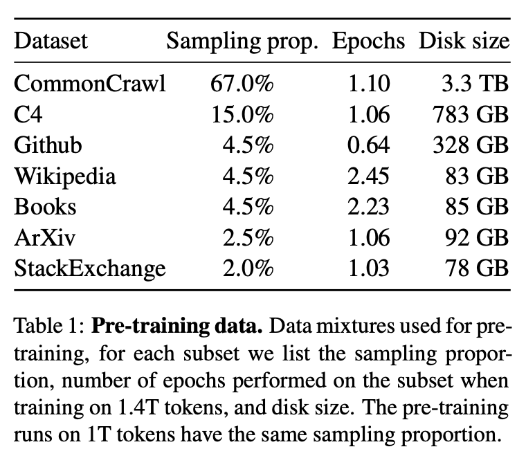

# LLaMA

LLaMA 是一个开源的基础语言模型集合，参数范围从7B到65B，完全使用公开的数据集在数万亿 Token 上训练。

论文链接 [LLaMA: Open and Efficient Foundation Language Models](https://arxiv.org/pdf/2302.13971.pdf)

## 动机
在大量的文本语料库中训练的大型语言模型（LLMs）已经显示出它们能够从文本指令或少数例子中形成新的任务（Brown等人，2020）。

在将模型扩展到足够大的规模时，首次出现了这些少见的特性（Kaplan等人，2020年），从而形成了一个专注于进一步扩展这些模型的工作路线（Chowdhery等人，2022年；Rae等人，2021年）。

这些努力都是基于这样的假设：更多的参数会带来更好的性能。然而，Hoffmann等人（2022）最近的工作表明，在给定的计算预算下，最好的性能不是由最大的模型实现的，而是由在更多数据上训练的较小的模型实现的。

Hoff-mann等人（2022）的缩放定律的目标是确定如何在特定的训练计算预算下最佳地扩展数据集和模型大小。然而，这个目标忽略了推理预算，而推理预算在大规模服务语言模型时变得至关重要。

在这种情况下，给定一个目标性能水平，首选的模型不是训练速度最快的，而是推理速度最快的，尽管训练一个大的模型以达到一定的性能水平可能更便宜，但训练时间较长的小模型最终会在推理中更便宜。

例如，Hoffmann等人（2022年）曾建议在200B的token上训练一个10B的模型，但研究发现7B的模型的性能甚至在1T的token之后还能继续提高。

因此，该工作的重点是训练一系列语言模型，通过对比通常使用的更多的token进行训练，在不同的推理预算下达到最佳的性能。

该工作得到的模型被称为LLaMA，参数范围从7B到65B，与现有的最佳LLM相比，具有竞争力的性能。

尽管LLaMA-13B比GPT-3小10倍，但在大多数基准测试中都超过了GPT-3。这个模型将有助于增强对LLM的访问和研究，因为它可以在单个GPU上运行。此外，65B参数模型也可以与最好的大型语言模型（如Chinchilla或PaLM-540B）竞争。

特别的，与Chinchilla、PaLM或GPT-3不同的是，该工作只使用公开可用的数据，这使得工作符合开源原则，而大多数现有模型所依赖的数据要么没有公开可用，要么没有记录（例如 "书籍-2TB "或 "社交媒体对话"）。

## 训练数据

在Tokenizer进行切分方面，该工作我们用bytepairencoding（BPE）算法（Sennrich等人，2015）对数据进行切分，并使用Sentence-Piece（Kudo和Richardson，2018）进行实现。值得注意的是，该将所有数字拆分为单个数字，并退回到字节来分解未知的UTF-8字符。

## 模型架构
采用 transformer decoder-only 架构。

和transformer的区别：

**1）Pre-normalization [GPT3].**

为了提高训练的稳定性，我们对每个变换子层的输入进行规范化，而不是对输出进行规范化。
并使用Zhang和Sennrich（2019）介绍的RMSNorm归一化函数。

**2）SwiGLU activation function [PaLM].**

采用SwiGLU激活函数取代由Shazeer（2020）介绍的ReLU非线性方法，以提高性能。此外，在维度上使用的维度是2/3*4d，而不是PaLM中的4d。

**3）Rotary Embeddings [GPTNeo].**

在位置编码上，删除了绝对位置嵌入，而在网络的每一层增加了Su等人（2021）介绍的旋转位置嵌入（RoPE）。

## 高效实现
加速训练：
- 使用了xformers库。
- 减少了activation checkpointing 中，重新计算 activation 的计算量。手动实现 transformer 层的反向传递函数，保存了计算成本高的 activations，例如线性层的输出。
- 通过使用 model parallelism 和 sequence parallelism 来减少显存的使用量。
- 尽可能地将 activations 的计算和GPU之间的通讯进行并行。

加速效果：
- 65B的模型，在2048个80G的A100 GPU上，可以达到380 tokens/sec/GPU的速度。训练1.4T tokens需要21天。

## reference
- [LLaMA论文研读｜小参数+大数据的开放、高效基础语言模型阅读笔记](https://hub.baai.ac.cn/view/24440)
- [LLaMA 超详细解读（paper & code）](https://zhuanlan.zhihu.com/p/632102048)