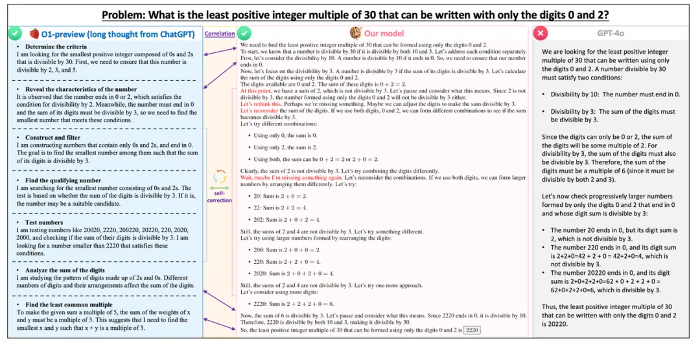
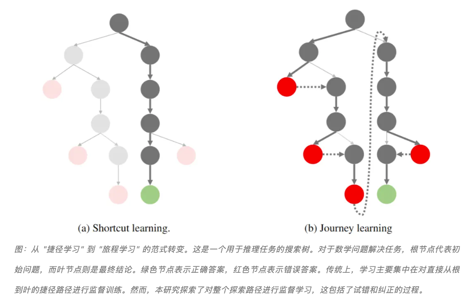
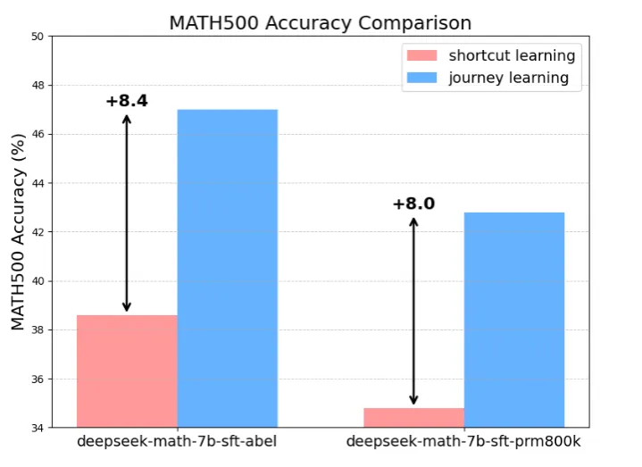

# o1 Replication Journey: A Strategic Progress Report (o1 探索之旅：战略进展报告)

- 推送链接 [o1 探索之旅：战略进展报告](https://mp.weixin.qq.com/s/ZO_Rv98OakPuBaZl9Tw5VA)
- 技术报告链接：https://github.com/GAIR-NLP/O1-Journey/blob/main/resource/report.pdf
- Github 链接：https://github.com/GAIR-NLP/O1-Journey
- o1 讨论资源：https://github.com/GAIR-NLP/O1-Journey/tree/main/resource

从 “"捷径学习"” 到 “旅程学习”，从 “浮光掠影” 到 “深耕细作”

团队认为，大多数现有的机器学习或大模型训练方法（如监督式微调）都可以被归类为 "捷径学习" (Shortcut Learning)，即模型学习到达正确答案的直接路径。这种传统范式虽然在特定、明确定义的任务中可能有效，但在面对复杂、动态和开放性问题时显示出明显的局限性。捷径学习具有以下几个关键特征：(1) 注重快速结果：强调在短时间内达到特定的性能指标或完成特定任务。(2) 高度依赖数据：性能改进通常依赖于增加训练数据量，而非改进学习算法本身。(3) 泛化能力有限：在训练数据分布之外的场景中，性能可能会急剧下降。(4) 缺乏自我纠正能力：这些系统通常缺乏识别和纠正自身错误的能力。尽管捷径学习推动了人工智能的许多进步，但它难以产生真正智能和可靠的人工智能系统，无法应对现实世界挑战的复杂性。随着我们追求更高级形式的人工智能甚至超级智能，这种方法的局限性变得越来越明显。

认识到这些缺点，本文提出了一种名为 "旅程学习"（Journey Learning) 的新范式。旅程学习旨在使人工智能系统能够通过学习、反思、回溯和适应不断进步，就像人类一样，从而展现出更高水平的智能。

团队提出了 "旅程学习" 范式，它鼓励模型不仅学习捷径，还要学习完整的探索过程，包括试错、反思和回溯。仅使用 327 个训练样本，不借助任何额外训练技巧，旅程学习在 MATH 数据集上的表现就超过了传统监督学习 8% 以上，展示了其极其强大的潜力。作者也认为这是 o1 技术中最关键的组成部分。

