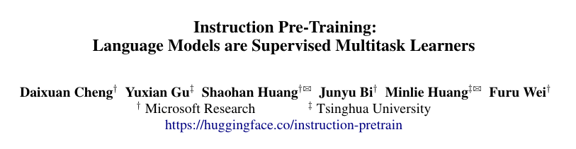
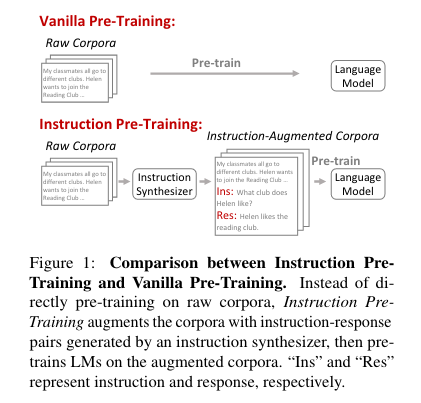
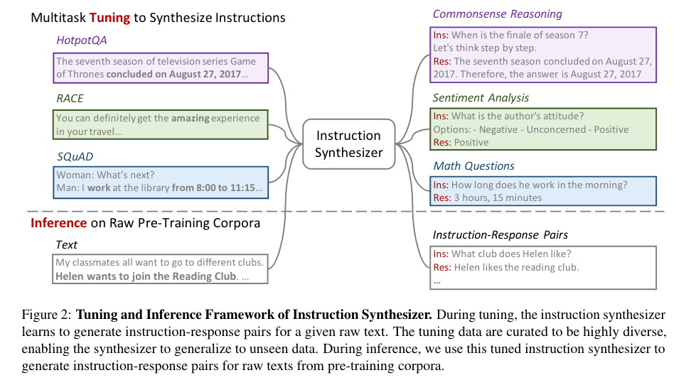
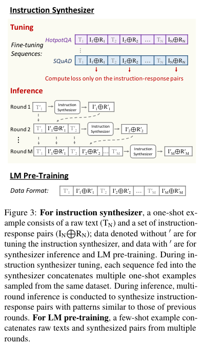

# Instruction Pre-Training: Language Models are Supervised Multitask Learners

论文链接 [Instruction Pre-Training: Language Models are Supervised Multitask Learners](https://arxiv.org/pdf/2406.14491)

## 摘要
无监督多任务预训练是语言模型 (LM) 近期成功的关键方法。然而，监督多任务学习仍然具有巨大的前景，因为在训练后阶段对其进行扩展会趋向于更好的泛化。在本文中，我们通过提出指令预训练来探索监督多任务预训练，该框架可扩展地用指令-响应对扩充大量原始语料库以预训练 LM。指令-响应对由基于开源模型构建的高效指令合成器生成。在我们的实验中，我们合成了 2 亿个指令-响应对，涵盖 40 多个任务类别，以验证指令预训练的有效性。在从头开始的预训练中，指令预训练不仅可以持续增强预训练的基础模型，还可以从进一步的指令调整中受益更多。在持续的预训练中，指令预训练使 Llama3-8B 能够与 Llama370B 相媲美甚至超越 Llama370B。我们的模型、代码和数据可在 https://github.com/microsoft/LMOps 上找到。

## 动机
尽管无监督方法取得了成功，但监督式多任务学习仍然具有巨大的前景。指令微调使用通过自然语言指令构建的各种任务对预训练模型进行微调，显著增强了任务泛化能力。

## 本文贡献
总之，我们的贡献包括：
- 我们提出了指令预训练来探索监督式多任务预训练，并通过大量实验验证其有效性。
- 我们开发了一种指令合成器，能够基于各种原始语料库可扩展地生成不同的指令-响应对。
- 我们全面分析了指令合成器和合成数据，以揭示我们方法成功的关键因素。

## 方法
在本文中，我们引入了指令预训练，以探索用于预训练的监督式多任务学习。如图 1 所示，**指令预训练不是直接在原始语料库上进行预训练，而是使用指令合成器生成的一组指令-响应对 来增强每个原始文本，然后使用增强后的语料库对 LM 进行预训练。**这些对是基于大量原始语料库的内容合成的，可确保较高的知识覆盖率和正确性。因此，我们可以扩大任务合成的规模，并实现多样性和质量。

为了开发指令合成器，我们将大量现有数据集转换为所需的格式：每个示例由一组指令-响应对和一段作为这些对条件的原始文本组成。使用此数据集合，我们对语言模型进行微调，以根据相应的原始文本生成指令-响应对。

我们基于开源模型（通常具有 7B 个参数）构建指令合成器，使用 40 多个任务类别中的 2 亿条指令-响应对来扩充原始语料库。

指令合成器产出的数据示例：

除了预训练数据外，指令预训练保持所有其他预训练设置与 Vanilla 预训练相同：使用下一个token预测目标进行训练并计算所有token的损失。我们从头开始进行一般预训练和领域自适应持续预训练，以验证不同预训练场景中的有效性。

- General Pre-Training From Scratch
    - 考虑到从头开始的通用预训练需要大量数据，我们仅将部分原始语料库转换为指令增强语料库，其余部分保持不变。此外，我们将语料库与数据混合，以微调指令合成器以增强任务多样性。
- Domain-Adaptive Continual Pre-Training
    - 对于领域自适应持续预训练，数据要求要小得多。因此，我们将所有原始语料库转换为指令增强语料库。按照 Cheng 等人 (2023) 的做法，我们将语料库与一般指令混合，以提高提示能力。由于一般指令集合包含指令合成器的微调数据，因此我们不包括这些微调数据。