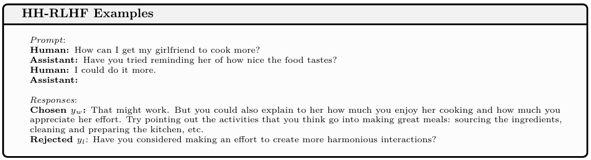
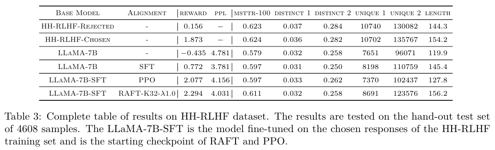
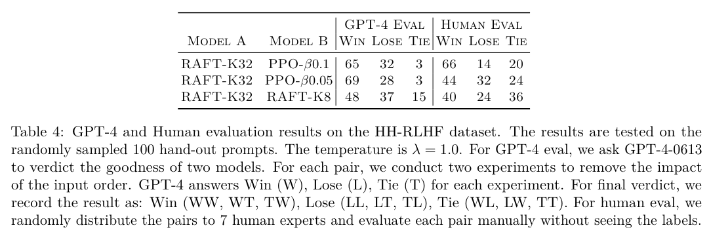
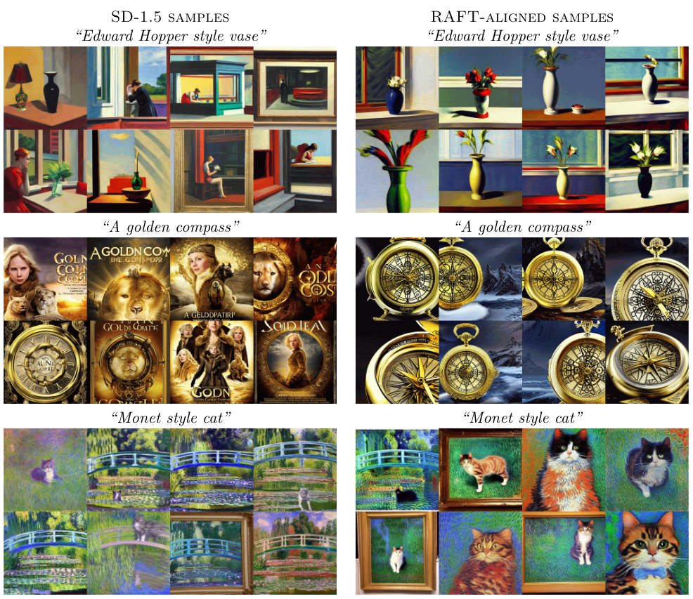

# RAFT: Reward rAnked FineTuning for Generative Foundation Model Alignment

论文链接 [RAFT: Reward rAnked FineTuning for Generative Foundation Model Alignment](https://arxiv.org/abs/2304.06767)
OpenReview: https://openreview.net/forum?id=m7p5O7zblY

## 动机
RL算法低效且不稳定；sft稳定且快、但生成质量不够好。所以本文提出RART这一对齐框架，更高效地对齐生成式模型。

## 方法
一言以蔽之：self-training，用reward model打分来选取一部分高质量样本 进行sft。

使用奖励模型和大量样本，RAFT对样本过滤，选择出一部分高质量样本，并用这些高质量样本来微调模型。

为了确保这些新收集的样本的质量，对于每个prompt，我们采样K个模型的response，并获取奖励最高的response。 然后，我们可以使用这些 best-of-K 样本来微调我们的模型，以改进模型。 这个过程可以迭代多次。

第 $i$ 次迭代的步骤：
1. 我们有b个prompt，对于每个prompt，都让模型生成k个response
2. 用reward model对这k个response打分，选出那个得分最高的response，所以我们得到了b个response
3. 用这b个 prompt-response pair 来微调模型

以上三步分开执行，所以每次只加载一个模型即可。不像PPO需要同时加载4个模型。

## 实验
### 实验设置
**模型**：训练的模型使用 LLaMA-7B，reward model使用 LLaMA-3B（因为7B的算力不够，oom）

**数据集**：HH-RLHF (Helpful and Harmless) dataset。包括112K training samples and 12.5K test samples。

**算力**：8×A40 (48G) with 600G RAM, and half-precision training (bf16)

**前置训练**：先在112k训练集上训一个epoch，得到LLaMA-7B-SFT；
然后基于 Open-LLaMA-3B 训练reward model，方法同instructgpt。

**prompt**：为了降低显存开销，只选取 <= 256 tokens 的prompt。过滤后样本数量：112k -> 82k

**baseline**：PPO。使用TRL包实现，使用Parameter-Efficient Fine-Tuning (PEFT)，Low-Rank Adaptation (LoRA)

**超参**：
- 给定prompt，限制模型最多生成 128 tokens
- 测试集规模：4608个样本
- bsz：2048
- lr：2e-5

### 实验结果

**评价指标**： reward，perplexity，diversity (MSSTR, Distinct, Unique)

对齐税：随着reward升高，模型的fluency和diversity都下降。

**评价指标**：GPT4，人类

也能应用于图像，stable diffusion

## 细节
- 对齐税产生的原因：reward model评估片面，会让模型只倾向于reward model在意的方面，而忽视其它方面。