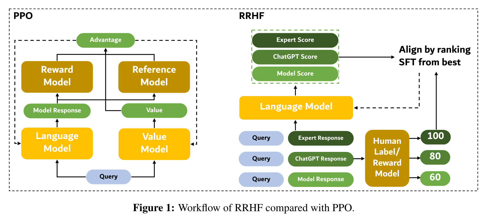
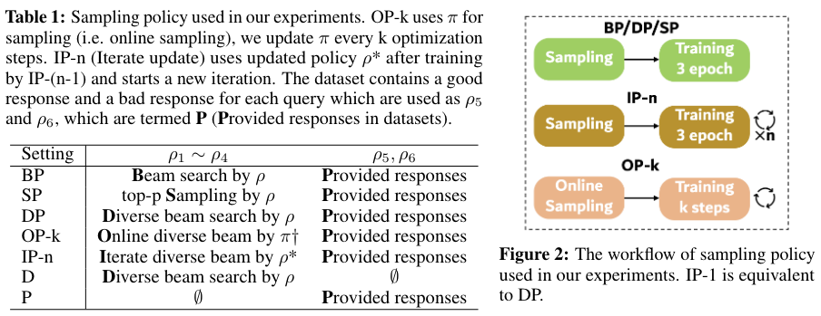
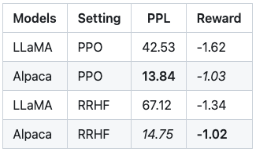
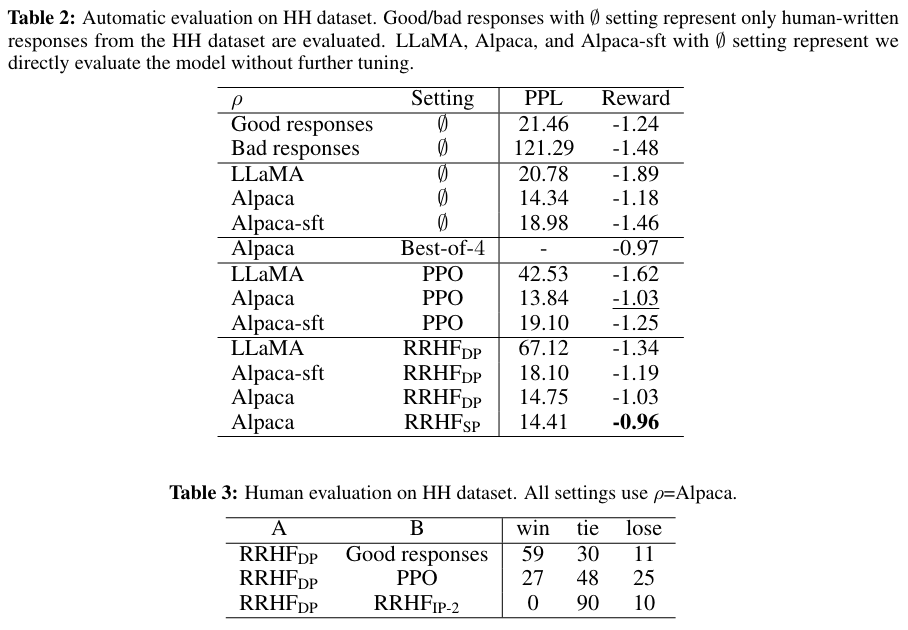

# RRHF: Rank Responses to Align Language Models with Human Feedback without tears

论文链接 [RRHF: Rank Responses to Align Language Models with Human Feedback without tears](https://arxiv.org/pdf/2304.05302.pdf)

github https://github.com/GanjinZero/RRHF

## 动机
RLHF：训练reward模型生成分数，应用PPO算法让模型对齐。

PPO算法的弊端：复杂；需要同时储存很多大模型（内存or显存？）

## 方法

多来源采样：模型自身的输出结果；chatgpt的输出结果；人类标注结果。

RRHF利用不同来源的生成结果数据进行训练。
用模型生成不同结果的log概率作为score，score要符合人类认为合理的顺序。
本文使用reward model给出的分数排序（而不是绝对打分）对模型做优化。

【排序loss】
如下方公式所示，$p_i$是模型生成第$i$个response的概率。$r_i$是第$i$个response获得的reward打分。这个排序loss要求，模型要给reward更高的response更高的输出概率。

【sft loss】下方公式代表，用reward最高的response对模型做sft。

【total loss】

相较于PPO，RRHF不需要reference model（可能是PPO前的固定模型）来计算KL散度。
PPO 在训练期间使用 4 个模型，而 RRHF 仅需要 1 或 2 个模型。

我们发现学习模型的平均奖励分数接近于训练中使用的生成样本的最大奖励分数的平均值。这表明 RRHF 的目标是从 best-of-n 采样中学习。

RRHF与RLHF的区别：
- RLHF在采样的时候，只使用训练的模型自身的输出结果；而RRHF则使用各种来源的response（模型自身，chatgpt，人类标注）。
- RLHF是在线采样模型输出结果；RRHF在训练前先采样好（所以无需KL散度项）。
- RLHF在PPO的时候，把reward model对模型当前输出结果的打分作为损失函数的一部分，直接优化这个reward分数。RRHF是用【模型对好几种输出的概率】计算排序对比损失。
- RRHF本身也可以说是在训一个reward model。

## 实验
### 实验设置
**数据集**：[Anthropic’s Helpful and Harmless (HH) dataset](https://huggingface.co/datasets/Dahoas/rm-static)

**模型**：LLaMA-7B，Alpaca-7B

**reward model**：[Dahoas/gptj-rm-static](https://huggingface.co/Dahoas/gptj-rm-static)

**采样方法**：vanilla beam search, diverse beam search, top-p sampling

**超参**：3 epoch, lr=2e-5, bsz=64, query+response <= 192 tokens

**算力**：8 80GB Nvidia A100，4-6 hours

**baseline**：PPO

**metrics**：perplexity (gpt2-medium), average reward score (Dahoas/gptj-rm-static), human labelers

### 实验结果

> **RRHF 与在线采样** 
> 
> 我们主要使用初始模型 ρ 进行采样实验。 使用训练模型π进行采样还需要一个奖励模型进行在线评分。 我们尝试像 PPO 这样的在线采样，并且每 32 个优化步骤更新一次采样策略。 我们在表 6 中显示了结果。在这种设置下，平均奖励迅速提高到 0.34，而 PPL 则变差到 63.78。 我们手动检查 OP-32 的结果，它会产生非常友好但毫无意义的响应，例如“听起来很棒！” 我感谢您的帮助。 感谢您的帮助！ 不客气！ 我很高兴能提供帮助。 如果您需要更多帮助，请告诉我。 案例研究表明奖励模型在某种程度上被这种设置欺骗了。 为了缓解这个问题，我们像 PPO 一样将 KL 散度添加到奖励评分中，KL 系数为 0.01。 它获得的平均奖励为-0.86，优于 PPO 和 RRHFDP，合理的 PPL 为 19.76。 该设置的性能令人满意，但还需要一个计算KL散度的参考模型，并且需要调整KL系数，这与我们的初衷相反。
> 
> 我们可以发现在线采样技术（PPO和在线采样RRHF）可能具有更高的上限性能，但存在以下困难：（a）它们需要更多的GPU资源来存储参考模型； (b) 训练速度较慢，因为需要在自回归采样和并行训练之间切换模式； (c) 他们需要调整更多的超参数，包括 KL 系数和 rollout 步骤。 考虑到与在线采样技术相比的上述优点，RRHF 是在资源有限的情况下可采用的对齐方法。

## 疑惑
- 代码中没看出【多来源采样】？