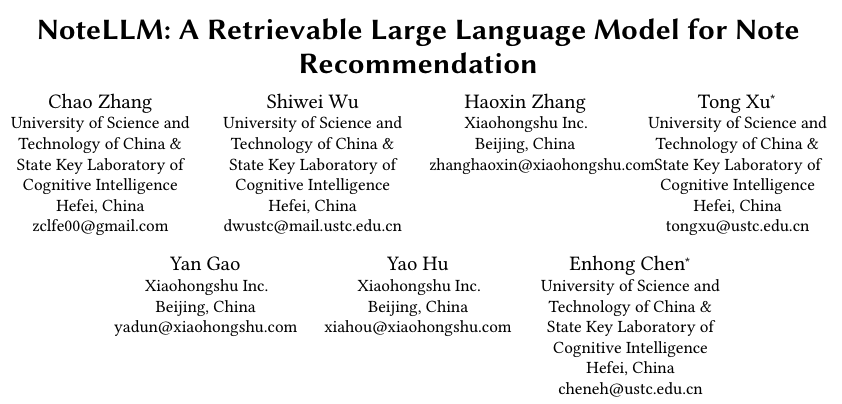
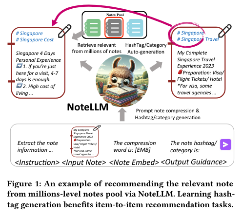
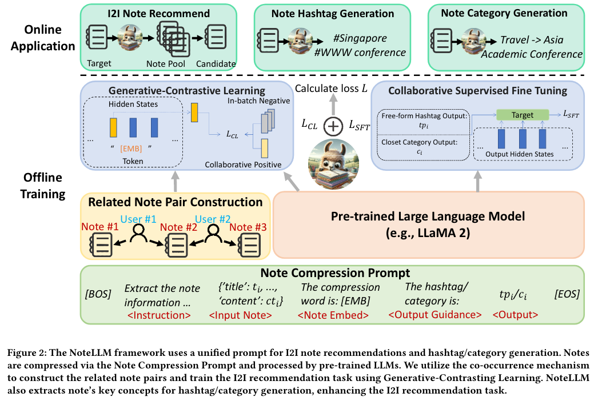
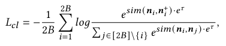
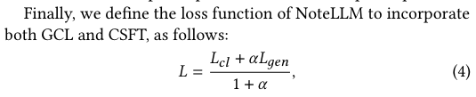

# NoteLLM: A Retrievable Large Language Model for Note Recommendation

论文链接 [NoteLLM: A Retrievable Large Language Model for Note Recommendation](https://arxiv.org/pdf/2403.01744)

## 动机
- 推荐用户感兴趣的笔记 是很重要的目标。
- 现有方法的不足
    1. 线索没利用充分：仅仅把笔记内容全部输入基于BERT的模型来生成 note embeddings，用于计算相似度；这没有充分利用一些重要线索 比如 #或类别。如果能学习生成 hashtags/categories，就能增强 note embeddings。
    2. 模型能力不足：LLM已经远超BERT

## 本文贡献
In this paper, we propose a novel unified framework called NoteLLM, which leverages LLMs to address the item-to-item (I2I) note recommendation.

## 方法

### Note Compression Prompt
- 多任务训练：（对llm输入一个prompt）使用LLM根据note内容，生成 note embedding 以及 hashtag/category。

- embedding用于通过GCL获取协作知识，然后通过CSFT使用这些知识生成hashtags/categories （？）

### Generative-Contrastive Learning
- 仅仅依靠LLM中的语义信息不足以完成推荐任务。LLM 中缺少协作信号，而协作信号在识别用户特别感兴趣的笔记方面起着至关重要的作用 [6, 20]。因此，我们提出了 GCL，使 LLM 能够捕获更强大的协作信号。与从特定答案或奖励模型中学习不同，GCL 采用对比学习，从整体角度学习笔记之间的关系接近度。
- 为了将协作信号集成到 LLM 中，我们采用共现机制根据用户行为构建相关笔记对。该机制基于经常一起阅读的笔记很可能是相关的假设。因此，我们收集一周内的用户行为数据以进行共现计数。
- 对比学习 训练embedding，loss如下

    

### Collaborative Supervised Fine-Tuning
- 生成主题标签/类别的任务从文本生成的角度提取关键笔记信息，而生成笔记嵌入的任务从协作的角度将笔记压缩为虚拟词，以进行 I2I 推荐。

    