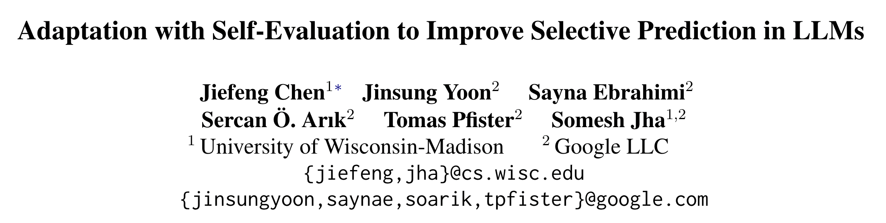
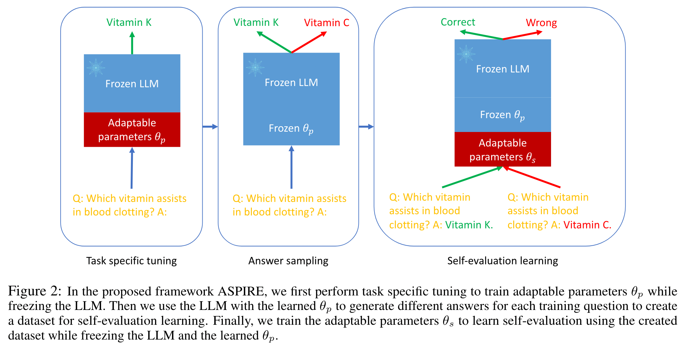

# Adaptation with Self-Evaluation to Improve Selective Prediction in LLMs

论文链接 [Adaptation with Self-Evaluation to Improve Selective Prediction in LLMs](https://aclanthology.org/2023.findings-emnlp.345.pdf)

## 动机
- LLM应该能够评估自己预测的准确性并避免做出错误的预测。如果LLM发现某个问题的答案可能是错误的，它应该能输出【我不知道】，这有助于LLM被可靠地使用。
- 现有的 selective prediction 方法存在缺陷，比如有的工作提出 heuristic prompts，引导模型评价自己的输出，但相同的prompt或许不适用于所有LLM；有的工作提出 semantic entropy，self consistency，但这些方法需要模型同时输出好几种结果，会消耗更多计算资源。

因此，本文提出 Adaptation with Self-Evaluation to Improve Selective Prediction in LLMs (ASPIRE)。

## 效果
> ASPIRE achieves the state-of-the-art selective prediction performance on three question answering datasets: CoQA, TriviaQA and SQuAD, using OPT and GPT-2 models.

## 方法

## 相关工作
Selective Prediction.
> 选择性预测（Geifman 和 El-Yaniv，2017）广泛指的是人工智能模型的部署场景，其中人类通过审查人工智能生成的低置信度输出来维持整体准确性。

Parameter Efficient Fine-tuning.
> Existing PEFT approaches include LoRA (Hu et al., 2021), Prefix Tuning (Liu et al., 2021a), Soft Prompt Tuning (Lester et al., 2021) and P-Tuning (Liu et al., 2021b).
