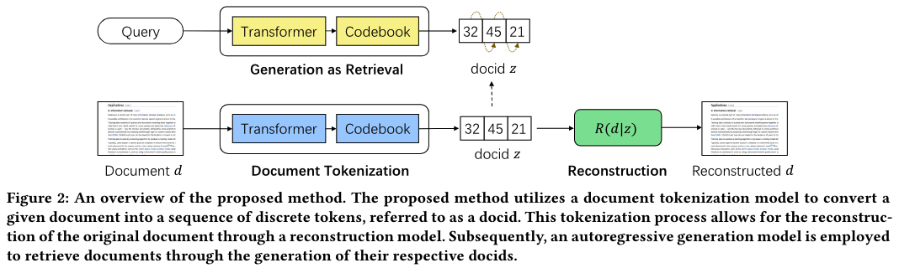
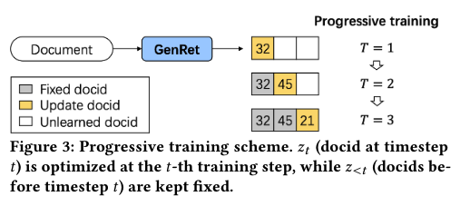
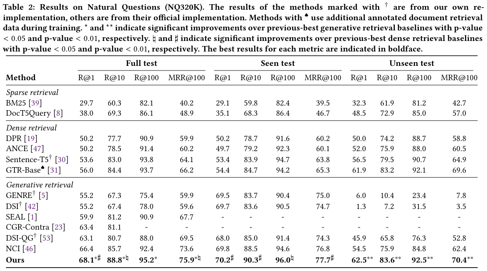
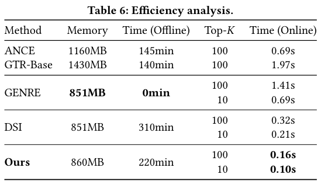
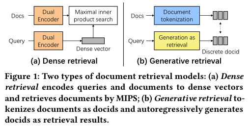

# Learning to Tokenize for Generative Retrieval

论文链接 [Learning to Tokenize for Generative Retrieval](https://arxiv.org/pdf/2304.04171.pdf)

## 一句话概括
**本文使用自编码的方式生成文档标识docid。**
通过优化文档标识，能够提升生成式检索效果。

## 动机
1. 传统的文档检索技术主要基于索引检索范式。但这种范式难以通过端到端来优化。
比如dense retrieval 在获得query和doc的向量后，具有固定的索引检索过程（最大化内积搜索），就是分成了【获得向量】和【寻找最大内积的向量】这两步，这使得难以通过端到端的方式联合优化这个过程。

2. 生成式检索将文档表示为标识符 (docid)，并通过生成 docid 来检索文档，从而实现文档检索任务的端到端建模。
但【如何定义文档标识符】是一个悬而未决的问题。当前定义文档标识符任务的方法依赖于固定的基于规则的 docid，例如文档标题或聚合 BERT 向量的结果，这些方法通常无法捕获文档的完整语义信息。

## 本文贡献
本文提出GenRet，一种文档标记学习方法，作为生成式检索使用的文档标识符。
GenRet通过离散自编吗（discrete auto-encoding approach）的方法，将文档标记为 短的、离散的表示。

GenRet包括三个部分：
- 一个标记模型，为文档生成docids
- 一个重构模型，从docid重构原文档
- 一个端到端的检索模型，为指定query生成相关文档标识。

通过自编码框架，GenRet能够用完全端到端的方式学习docid。

本文还设计了一种渐进式学习方案，以建模 docids 的自回归性质并稳定训练。（？）

实验结果表明GenRet效果非常好。

**idea是老方法（自编码获得表示），本文只是用在了新地方，方法没什么心意。胜在这个方法之前确实没人做，而且实验效果好。**

## 方法

### 模型优化
两个挑战：
1. docid以自回归形式生成，t时刻的预测依赖于之前的生成结果，而训练初期模型生成的不好，这会导致收敛慢。
2. 具有多样性的docid。使用自编码的方法优化模型 往往会导致docid分配不平衡：少数主要的docid被分配给大量文档，大多数其它docid很少被分配。这种次优分布会导致 模型为了区分docid冲突的文档 而增加docid的长度。

本文解决方案：
1. 渐进式训练计划
    - 固定住docid前缀，一个step一个step地训练
    - 三个loss：
        - 从docid重构doc的重构损失
        - a commitment loss for committing the docid and to avoid forgetting
        - 检索损失
2. 提出了一种参数初始化策略和基于多样化聚类技术的 docid 重新分配，以增加生成的 docid 的多样性。

### 细节
- 生成式检索模型使用受限解码策略，保证生成的docid都在文档集合中。具体而言，基于有效docid构建前缀树，将无效docid的生成概率设置为0。
- 模型使用beam search 检索得到多个doc

## 实验设置
### 数据集
NQ320K, MS MARCO, BEIR

### 模型
Doc tokenization and retrieval model: shared T5 Transformer, 模型结构相同。

doc或者query输入到T5后，decoder在 step t 输出的隐层表示 d_t 经过一个codebook（K*D，可以理解为K个D维向量），看 d_t 和codebook中的哪个向量内积最大，就选哪个向量，作为z_t。
docid就是m个z（其中每个z只能从k个固定的向量里选）

## 实验结果
- 在NQ320K上达到sota
- 泛化性强：在没见过的文档上显著提升

## 相关工作
### sparse retrieval
TF-IDF, query likelihood, or BM25
劣势：表面词汇不匹配。

### dense retrieval (DR)
DR方法使用dual encoder，学习query和document的标识，并通过最大化内积（maximal inner product search, MIPS）的方式检索文档。

DR的弊端：
- 采用具有固定搜索过程 (MIPS) 的索引检索管道，难以使用端到端的方式联合优化所有模块。
- 学习策略（比如对比学习）和预训练任务目标（语言模型）不一致，不能很好地利用预训练获得的知识。

### generative retrieval
生成式检索已经成为文档检索新范式。

对于一个query，生成式检索模型直接生成一个有序列表，每一项都是docid。

生成式检索模型涉及两个主要步骤：
- 文档标记化。每个文档都被tokenize为离散字符序列docid。
- 生成即检索，对一个query，通过自回归的方式直接生成docids

不同于DR，生成式检索为文档检索提供了端到端的解决方案，能够更好地利用大语言模型。

## take away
- 直接生成检索结果的话，这个结果（例如docid）最好是一个有意义的信息，首先是因为从人类的角度就便于理解记忆。要是生成url的话，记忆量太大、太难了。其次是因为要利于模型泛化。记url的话，显然没有泛化性，但是记语义的话，就算没见过也能够生成类似的东西。所以【检索的标识是什么】很重要。

