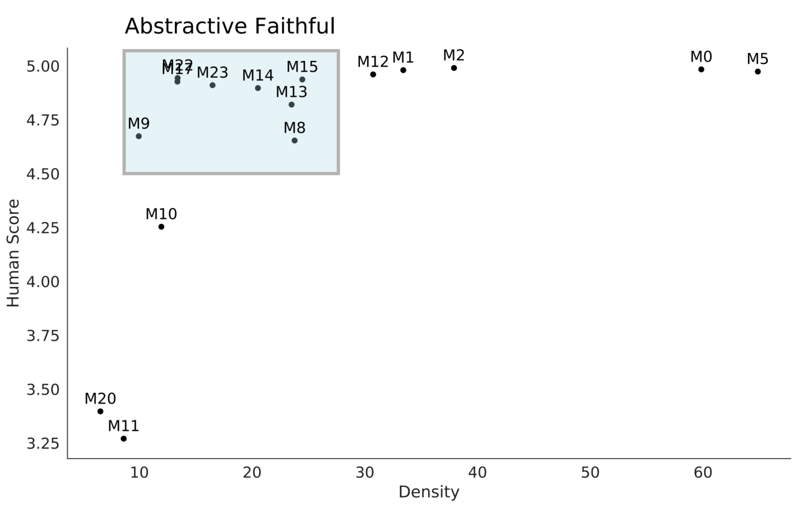
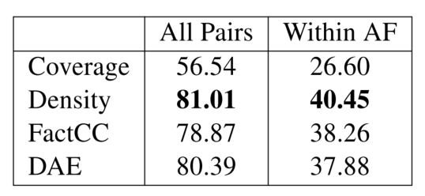
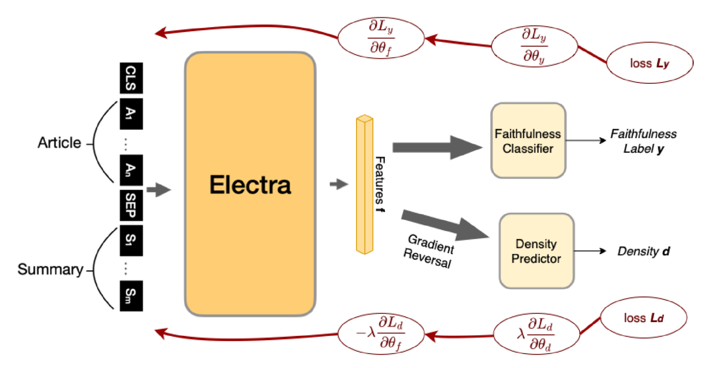
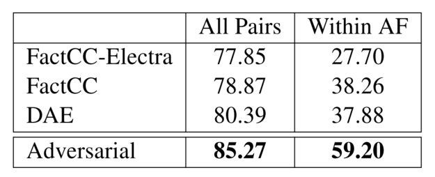

# 【acl2022】Spurious Correlations in Reference-Free Evaluation of Text Generation

## 主要内容
### 动机
- 仅对比模型预测和人类打分的相关性，可能对衡量指标的有效性和鲁棒性来说并不充分

### 本文论证思路
- 仅用虚假关联，也可以在任务上达到很好效果（甚至优于指标）；
- 控制虚假关联因素（选取density类似的样本），发现指标效果大幅下降，说明指标严重依赖该虚假关联；
- 对抗训练：模型除了预测评估分数的头，还有一个预测虚假关联分数的头；虚假关联预测器的梯度反转，从而得到【预测评估分数很厉害、但学不会该虚假关联】的表示。

### idea&方法&实验
#### 证明虚假关联
- 度量词重叠的两个指标：coverage和density。coverage测量摘要中有多少词在文章中出现过；density看摘要中来自文章的片段的平均长度
- 实验验证：某虚假关联（density测量）也能达到很好的和人类相关性

- 实验验证：控制虚假关联因素，则指标效果大幅下降。
- 表格表示所有语言对上，各个虚假关联or指标的效果；但是在图中蓝框内，它们效果大跌。就是说，控制density相近的时候，指标也难以分辨，这说明指标很大程度上依赖density。

#### 对抗训练
- 对抗训练：让表示更少地依赖虚假关联
- 模型除了预测评估分数的头，还有一个预测虚假关联分数的头。目标是：希望表示能很好地预测评估分数，但预测虚假关联很困难。所以，虚假关联预测器的梯度被反转，从而让预测评估分数更少地依赖虚假关联。
- λ初始0，逐渐增加到1

- 对抗训练实验结果超好，改进非常明显，而且在所有pairs上也做得更好了

## 思考总结
### 一些想法&疑惑
- 本文研究的是对话和摘要领域的无ref评估中的虚假关联，或许可以应用在qe上
- 本文对抗训练怎么做的？——给模型增加对抗头的方法很有意思！让预测不依赖于特定虚假关联，但这样要保证，这个虚假关联特别关键才行！（对词级别qe而言，就是一个词在训练集中标签分布？）
- 本文虚假关联词重叠是拍脑袋想的
- qe领域的虚假关联好像更分散一些？需要先测量仅使用各种虚假关联（或者naive方法，因为词对齐语言模型等等也不算虚假关联，只不过不能无脑不分场合地完全依赖而已）可以在qe上做到多好