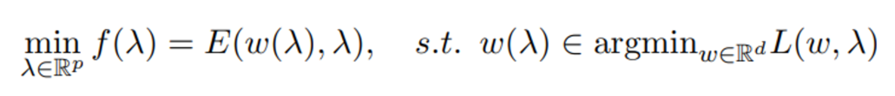
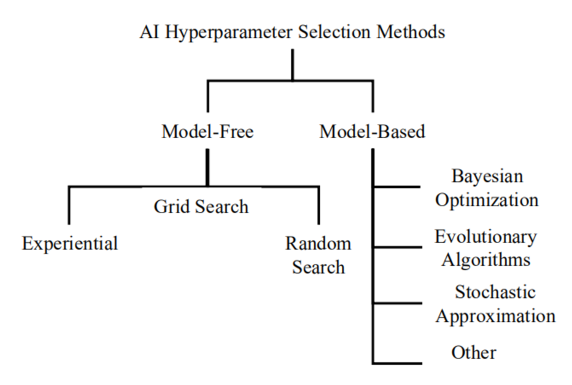
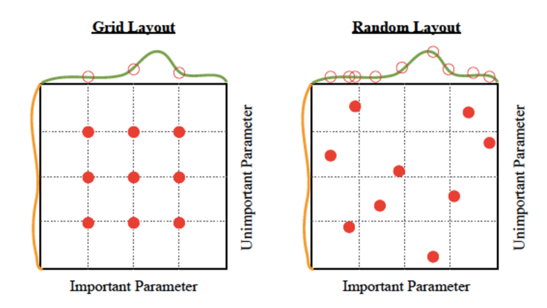
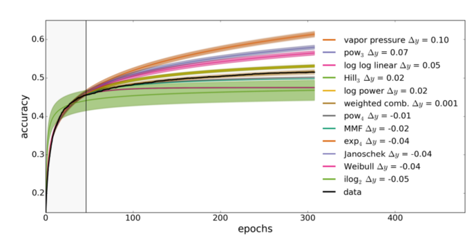
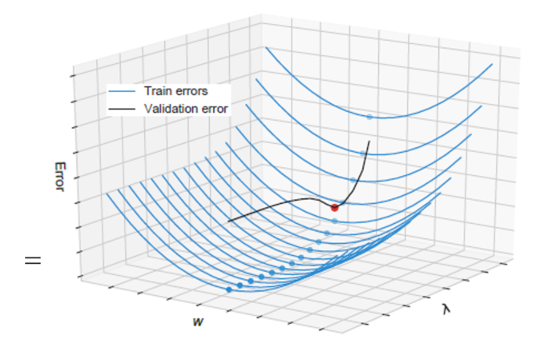
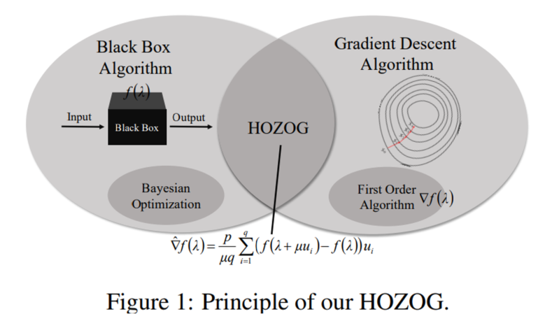
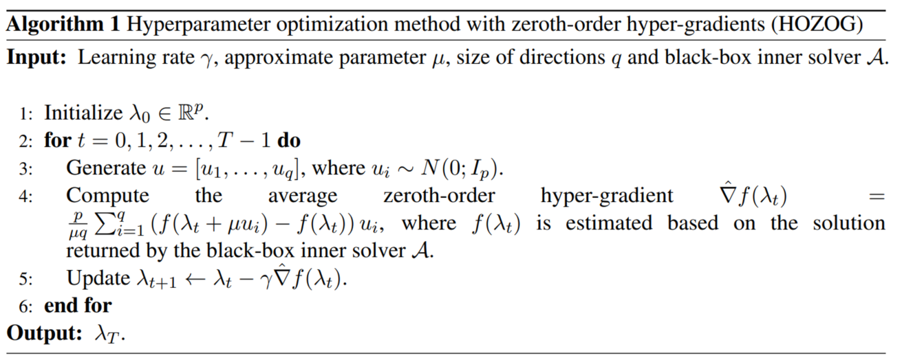
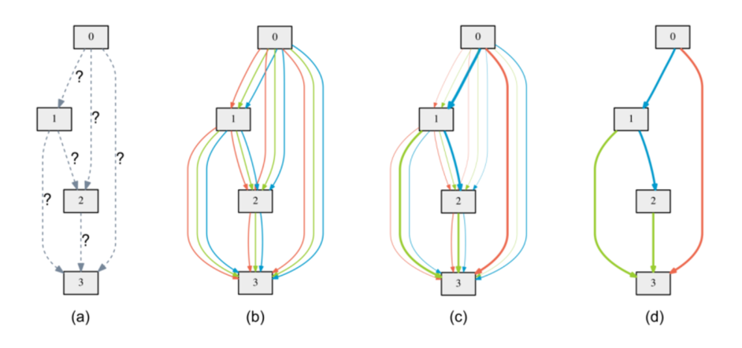

# 超参优化
耿祥
## 背景
- 超参数：相对于模型参数，不能在训练过程中自动学习而需要人工设置的参数
	- 训练参数：学习率，batch size等
	- 模型参数：层深、层宽等
- 超参优化：自动化机器学习的一个分支，将超参选择过程转换为优化问题，并通过算法自动求解
- 意义：节省人工
## 方法
- 优化目标：学到使损失函数最小化（评价函数最大化）的超参

- 分类：大致可以分为黑盒方法与白盒方法：其中黑盒方法只能看到目标模型的输入和输出
- 黑盒方法：model-free & model-based

### 黑盒方法：model-free
- Grid Search：按网格规律产生超参组合并验证结果
- Random Search：随机产生超参组合并验证结果
- 考虑到可能存在对结果性能影响显著的重要超参，随机搜索在实际中有更好的表现
- 两种方法都需要训练模型多次，耗时大

- 群体算法（进化算法、粒子群优化算法）：经典的黑盒优化算法，可以直接带入超参优化问题求解。
    - 需要足够多的初始样本点，优化效率也并不高。
- 模拟退火算法

### 黑盒方法：model-based
贝叶斯优化：随机搜索的次数足够多最终是能收敛到最优解的，但是随机搜索是盲目的，没有根据现有结果指导后续搜索
- 代理模型：根据已经观察到的超参-性能结果学习一个代理模型
- 采样：根据代理模型采样得到下一个超参数，考虑**置信区间**
- 测试：根据采样的超参数得到观测性能
- 更新：更新代理模型
- 常见的代理模型：高斯过程、高斯混合模型（高维空间表现更好）（最多支持优化几百个超参数）

### 多保真度方法
- 随着数据集和模型的发展，评估超参性能的代价越来越大
- 多保真度方法：通过降低保真度的评估算法来近似真实的评估值，节省训练开销
- 降低保真度
	- 采用部分训练数据
	- 降低数据维度
	- 减少模型大小
	- 早停
- 早停：学习曲线是人类观察模型学习过程的重要参考，通常优化曲线会保持一定的趋势，如果预测该曲线在以后都不可能超过目前的最优值，则进行早停节省训练开销。
	- 预定义曲线线性组合（问题：先验性太强了，事实上曲线不会很听话）
	
	
	
	- 像建模超参数一样，建模曲线变化规律，贝叶斯优化建模or神经网络建模，预测模型学习曲线
- 探索与利用
	- 探索：新超参所对应的性能
	- 利用：利用已有的结果生成可能的最优超参组合
	- multi-armed bandit：一排老虎机，每个老虎机吐钱概率固定但未知，如何在有限的本金下获得最大收益

### 白盒方法
- 知道模型内部信息
- 梯度方法：如果超参连续可微，可以通过计算Hyper-Gradient的方式进行梯度优化
- 优势：可以优化大量超参数（支持优化上万个超参数）

### 黑盒算法与梯度融合
- 然而，白盒模型少见
- HOZOG
	- 基于0阶梯度：数值近似梯度
	- 当前超参邻域随机采样，得到超参数验证损失，计算近似梯度
	
	
	- 需要尽量多的采样，来保障近似梯度准确（可以结合多保真度方法来改进）

### 神经网络架构搜索NAS
- 初始版本NAS
	- 预定义基本元素，如每层的隐层宽度、卷积宽度等，预定义好后每个结构就是一个模块组成的序列串
	- 大量搜索+policy gradient（强化学习策略梯度）来最大化controller采样网络的期望reward
- 改进版：预定义基本cell，粒度更粗，但是搜索效率更高，也会更精细
- 加速策略：参数共享
- 可微优化
	- 优化不同路径、不同操作类型（离散），
	- 优化时可以做连续缩放（softmax），就可以计算超参数梯度
	- 迭代优化：参数与超参数交替优化：不等超参数优化好，就用来优化参数；不等参数优化好，就用来优化超参。
	
	
### 总结
- 简单：格子搜索
- 效果好：贝叶斯搜索
- 梯度：可以解决噪音数据清洗的问题（对每个样本施加超参数）
- 神经网络架构搜索需要大量gpu
- 超参优化对数据集敏感（？）所以建立在独立同分布假设上

### 超参优化算法实用算法包
贝叶斯优化GPBO：http://github.com/fmfn/BayesianOptimization/
多臂赌博机HyperBand：https://github.com/automl/HpBandSter
梯度方法HOAG（传统机器学习）: https://github.com/fabianp/hoag
梯度方法RFHO（深度神经网络）：https://github.com/lucfra/RFHO
梯度方法HOZOG（黑盒）：https://github.com/jsgubin/HOZOG